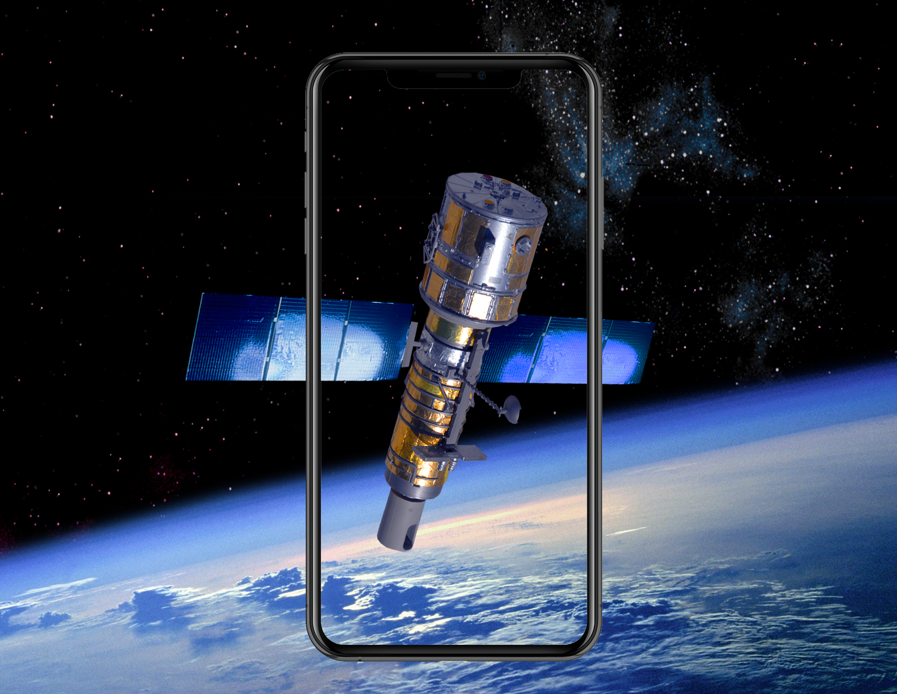

# Up There
Up There - NASA Space App Challenge 2020 

***ABOUT***  
Educational and useful application to get in touch with the satellites that surrounds us.<br/>
Learn, see, interact with space technology.<br/><br/>

App made with Ionic, Angular and capacitor.



## Project setup
```
git clone https://github.com/GuillaumeLandry/UpThere.git
```
```
cd UpThere
```
```
npm install
```

### Run on a webserver
```
npm run web
```

### Tun on android
```
npm run android
```

### Tun on IOS
```
npm run ios
```

___________________________________________________________
* Iphone in Space Image Credits: Erik Simonsen / Getty Images
